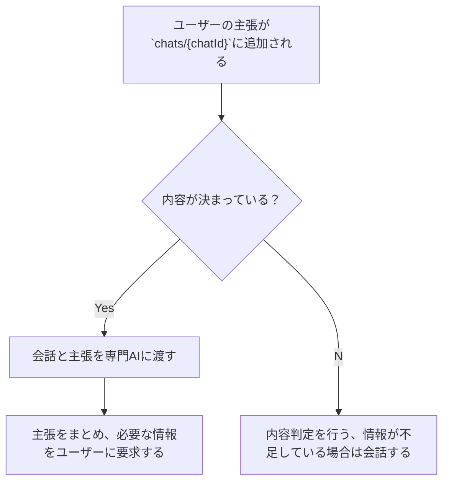

# Summary claim flow

```mermaid
graph TD
    A["ユーザーの主張が`chats/{chatId}`に追加される"] --> B{内容が決まっている？}
    B --Yes--> C[会話と主張を専門AIに渡す]
    B --No--> D[内容判定を行う、情報が不足している場合は会話する]
    C --> E[主張をまとめ、必要な情報をユーザーに要求する]
```