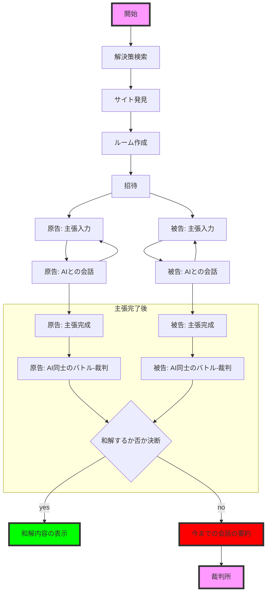

```mermaid
graph TD
    A[開始] --> B[解決策検索]
    B --> C[サイト発見]
    C --> D[ルーム作成]
    D --> E[招待]

    E --> F1[原告: 主張入力]
    F1 --> G1[原告: AIとの会話]
    G1 --> F1
    G1 --> H1[原告: 主張完成]

    E --> F2[被告: 主張入力]
    F2 --> G2[被告: AIとの会話]
    G2 --> F2
    G2 --> H2[被告: 主張完成]

    subgraph "主張完了後"
        H1 --> I1[原告: AI同士のバトル-裁判]
        H2 --> I2[被告: AI同士のバトル-裁判]
        I1 & I2 --> J{和解するか否か決断}
    end

    J --> |yes| K[和解内容の表示]
    J --> |no| L[今までの会話の要約]
    L --> M[裁判所]

    style A fill:#f9f,stroke:#333,stroke-width:4px
    style M fill:#f9f,stroke:#333,stroke-width:4px
    style K fill:#0f0,stroke:#333,stroke-width:4px
    style L fill:#f00,stroke:#333,stroke-width:4px
```